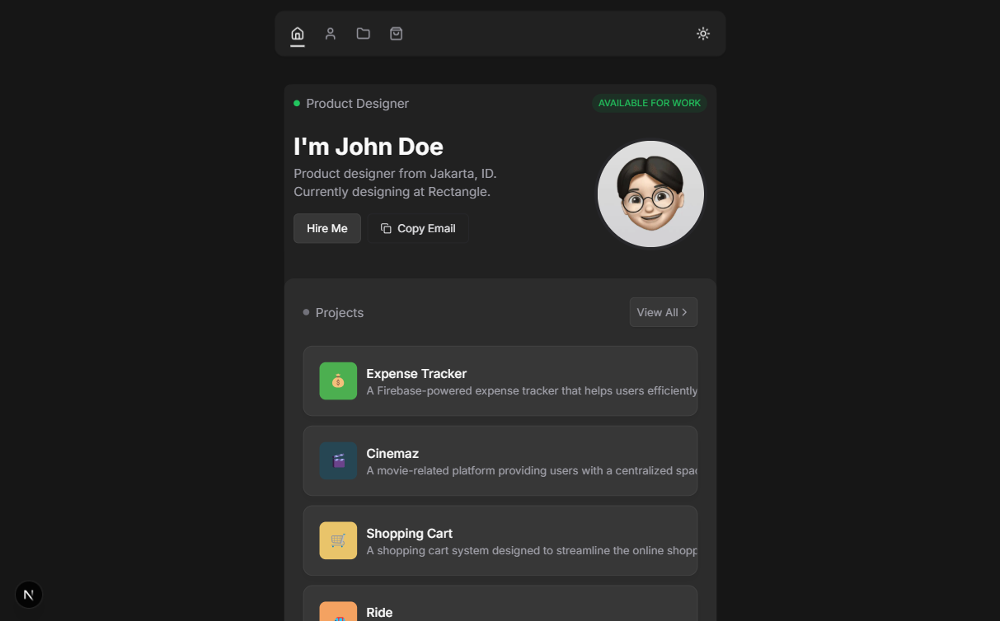
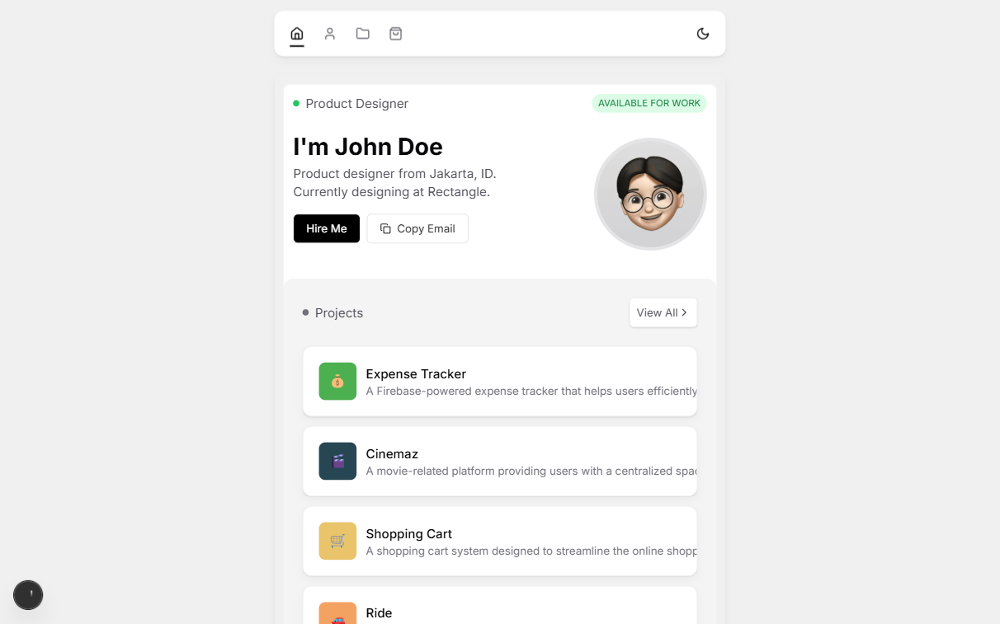
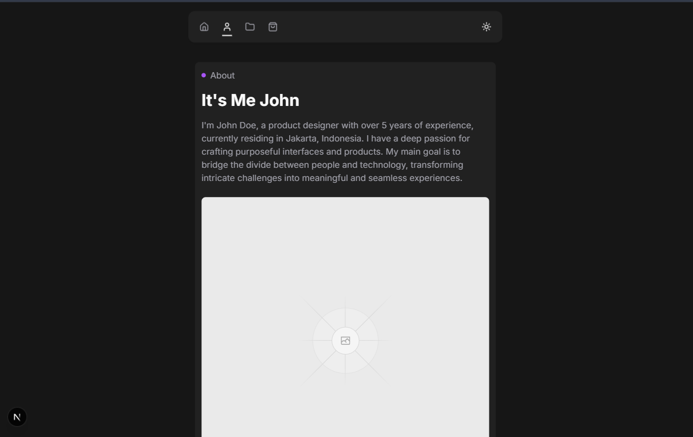
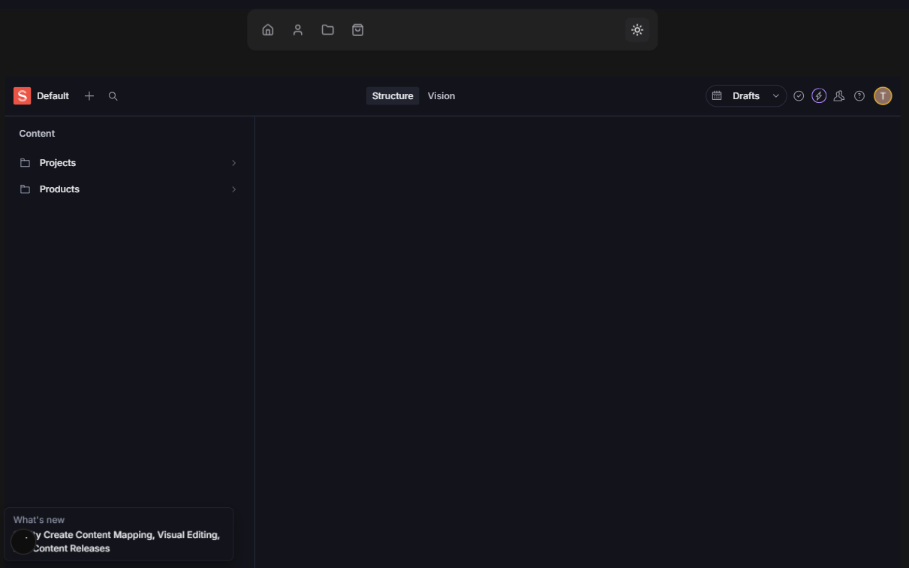

# Next.js + TypeScript + Sanity Minimalistic Portfolio Website 🚀


A modern, minimalistic portfolio website built with Next.js, TypeScript, and Sanity CMS, featuring smooth animations powered by Framer Motion. Perfect for developers and designers looking to showcase their work with style.



## Features ✨

- ⚡ **Blazing Fast Performance** with Next.js static generation
- 🎨 **CMS-Powered Content** using Sanity Studio
- 🌀 **Silky Smooth Animations** with Framer Motion
- 📱 **Fully Responsive Design**
- 🌈 **Modern Minimalist UI** with Tailwind CSS
- 🔒 **Type-Safe Codebase** using TypeScript
- 📝 **Easy Content Updates** through Sanity
- 🎯 **SEO Optimized** pages

## Technologies Used 🛠️

### Core Stack

- **Next.js** - React framework for server-side rendering and static site generation
- **TypeScript** - Type-safe JavaScript implementation
- **Sanity CMS** - Headless content management system
- **Tailwind CSS** - Utility-first CSS framework

### Animation & UI

- [**Framer Motion**](https://www.framer.com/motion/) - Production-ready animation library
- **React Icons** - Popular icons for React applications
- **Heroicons** - Beautiful hand-crafted SVG icons

### Utilities

- **Groq** - Sanity's query language
- **Date-fns** - Modern date utility library
- **React Intersection Observer** - Detect element visibility
- **React Hot Toast** - Elegant notifications

## Screenshots 🖼️

| Light Mode                                    | Dark Mode                                   | Project Studio                             |
| --------------------------------------------- | ------------------------------------------- | ------------------------------------------ |
|  |  |  |

## Getting Started 🏁

### Prerequisites

- Node.js ≥18.x
- npm/yarn
- Sanity account

### Installation

1. **Clone the repository**

   ```bash
   git clone https://github.com/devalentineomonya/Minimalistic-Portfolio-Website-NextJs-Ts-Sanity.git
   cd NextJs-Ts-Sanity-Minimalistic-Portfolio-Website
   ```

Install dependencies**

   ```bash
   pnpm install

   ```

3. **Sanity Setup**

   ```bash
   cd studio
  npx sanity install
   sanity start
   ```

4. **Environment Variables**
   Create `.env.local` in root directory:

   ```env
   NEXT_PUBLIC_SANITY_PROJECT_ID=your_project_id
   NEXT_PUBLIC_SANITY_DATASET=production
   ```

5. **Run Development Server**
   ```bash
   npm run dev
   # or
   yarn dev
   ```

## Configuration ⚙️

### Sanity Content Models

Modify schemas in `studio/schemas` to match your content structure:

```javascript
// Example Project Schema
{
  name: 'project',
  title: 'Project',
  type: 'document',
  fields: [
    // Add custom fields here
  ]
}
```

### Animation Customization

Edit Framer Motion props in components:

```tsx
<motion.div
  initial={{ opacity: 0, y: 20 }}
  animate={{ opacity: 1, y: 0 }}
  transition={{ duration: 0.5, delay: 0.2 }}
>
  {/* Your content */}
</motion.div>
```

## Key Framer Motion Implementations 🌀

1. **Page Transitions**
   - Smooth route changes with `AnimatePresence`
2. **Hover Effects**
   - Interactive element scaling and shadows
3. **Scroll Animations**
   - Reveal animations with `useInView`
4. **Staggered Loads**
   - Sequential element animations
5. **Interactive Components**
   - Animated buttons and cards

## Roadmap 🗺️

- [ ] Add dark mode toggle
- [ ] Implement blog functionality
- [ ] Add project filtering
- [ ] Enhance mobile animations
- [ ] Add contact form integration

## Contributing 🤝

Contributions are welcome! Please follow these steps:

1. Fork the project
2. Create your feature branch (`git checkout -b feature/AmazingFeature`)
3. Commit your changes (`git commit -m 'Add some AmazingFeature'`)
4. Push to the branch (`git push origin feature/AmazingFeature`)
5. Open a Pull Request

## License 📄

Distributed under the MIT License. See `LICENSE` for more information.

## Acknowledgements 🏆

- [Framer Motion](https://www.framer.com/motion/) for incredible animation capabilities
- Sanity team for the powerful headless CMS
- Next.js community for amazing documentation
- Tailwind CSS for utility-first inspiration

---

✨ **Crafted with care by [Your Name]** · [Live Demo](https://v3.devalentine.me) · [Report Bug]([https://github.com/devalentineomonya/repo](https://github.com/devalentineomonya/Minimalistic-Portfolio-Website-NextJs-Ts-Sanity/issues)
